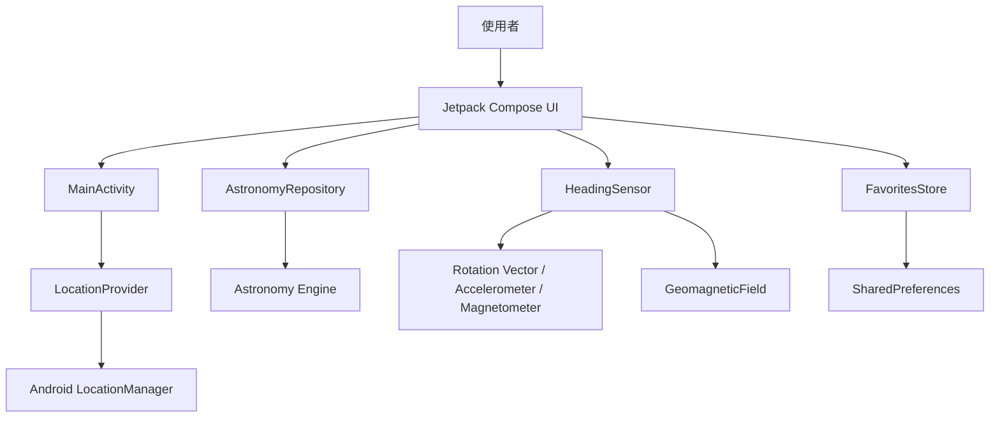

# 系統架構

## 架構概覽

本專案是單一 `app` 模組、單一 Activity 的 Jetpack Compose 應用程式。畫面狀態由 Compose 管理，天文計算、定位、感測器及本機收藏各自封裝於小型類別。

## 主要元件

| 元件 | 責任 |
|---|---|
| `MainActivity` | Edge-to-edge、系統列樣式、定位權限與 Compose 入口 |
| `PlanetFinderApp` | 畫面狀態、頁面導覽、首頁、收藏、尋星與詳情 UI |
| `AstronomyRepository` | 將位置與時間轉換為各星體的天空位置和觀測資料 |
| `LocationProvider` | 權限檢查、目前位置取得與台北預設位置 |
| `HeadingSensor` | 真北方位、手機仰角、螢幕旋轉修正與讀值平滑 |
| `FavoritesStore` | 使用 SharedPreferences 保存收藏 ID |
| `Angles` | 角度正規化、最短轉向與仰角提示等純函式 |

## 資料流

1. `MainActivity` 以台北預設位置建立 UI。
2. 使用者主動要求定位後，`LocationProvider` 回傳最新可用位置。
3. `PlanetFinderApp` 每 60 秒在背景 Dispatcher 呼叫 `AstronomyRepository.positions()`。
4. Repository 透過 Astronomy Engine 計算方位、仰角、升落與亮度資料。
5. 尋星頁啟動 `HeadingSensor`，將裝置姿態轉成真北方向與仰角。
6. UI 比較目標和裝置角度，產生轉向及抬高／降低提示。

## 導覽模型

目前不依賴 Navigation Compose，而使用小型狀態模型：

- 底部分頁：首頁、收藏、尋星。
- `detail`：目前開啟的星體資訊。
- `previousTab`：尋星頁返回前一分頁。
- `finderReturnDetail`：從資訊頁進入尋星後可回復原資訊頁。
- `BackHandler`：攔截 Android 返回事件，只有首頁根層級才交由系統關閉 Activity。

此方式適合目前有限的畫面數量；若未來加入設定、事件、搜尋或深層連結，建議改用 Navigation Compose。
