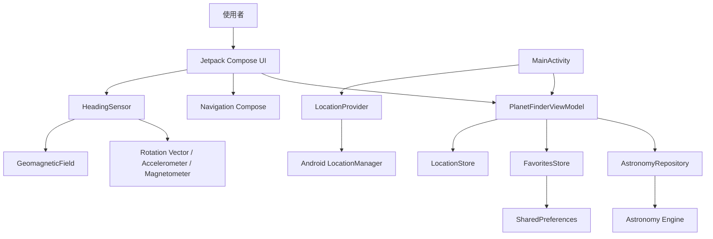

# 系統架構

## 架構概覽

本專案是單一 `app` 模組、單一 Activity 的 Jetpack Compose 應用程式。`PlanetFinderViewModel` 以 StateFlow 管理跨畫面狀態，Navigation Compose 管理返回堆疊；天文計算、定位、感測器及本機資料各自封裝。

## 主要元件

| 元件 | 責任 |
|---|---|
| `MainActivity` | Edge-to-edge、系統列樣式、定位權限與 Compose 入口 |
| `PlanetFinderViewModel` | 位置、收藏、觀測時間、背景天文計算與 StateFlow |
| `PlanetFinderApp` | Navigation Compose、首頁、收藏、尋星、詳情與對話框 UI |
| `AstronomyRepository` | 將位置與時間轉換為各星體的天空位置和觀測資料 |
| `LocationProvider` | 權限檢查、目前位置取得與台北預設位置 |
| `HeadingSensor` | 真北方位、手機仰角、螢幕旋轉修正與讀值平滑 |
| `FavoritesStore` | 使用 SharedPreferences 保存收藏 ID |
| `LocationStore` | 保存最後觀測位置及位置來源 |
| `Angles` | 角度正規化、最短轉向與仰角提示等純函式 |

## 資料流

1. `MainActivity` 以台北預設位置建立 UI。
2. 使用者主動要求定位後，`LocationProvider` 回傳最新可用位置。
3. `PlanetFinderViewModel` 在即時模式下每 60 秒於背景 Dispatcher 呼叫 `AstronomyRepository.positions()`。
4. Repository 透過 Astronomy Engine 計算方位、仰角、升落與亮度資料；太陽建立日出至日落預報，其他星體建立 18:00 至隔日 06:00 預報。
5. 尋星頁啟動 `HeadingSensor`，將裝置姿態轉成真北方向與仰角。
6. UI 比較目標和裝置角度，產生轉向及抬高／降低提示。

## 導覽模型

Navigation Compose 定義 `home`、`favorites`、`finder`、`finder/{bodyId}` 與 `detail/{bodyId}`。從詳情進入尋星時，詳情保留在返回堆疊；Android 返回鍵因此會自然返回原星體資訊頁。底部「今晚」使用明確的 `popBackStack("home")` 返回既有首頁，避免動態尋星路由的狀態還原阻止分頁切換。
